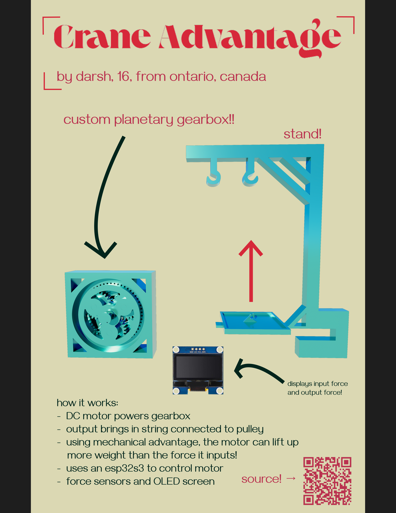
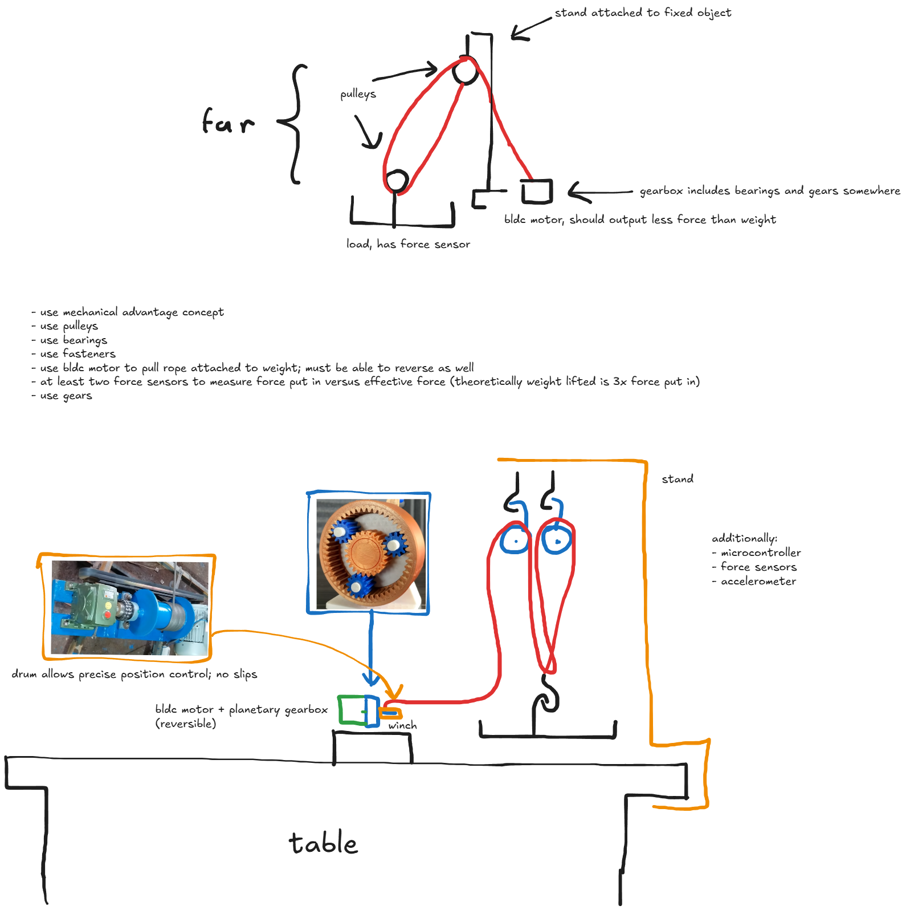
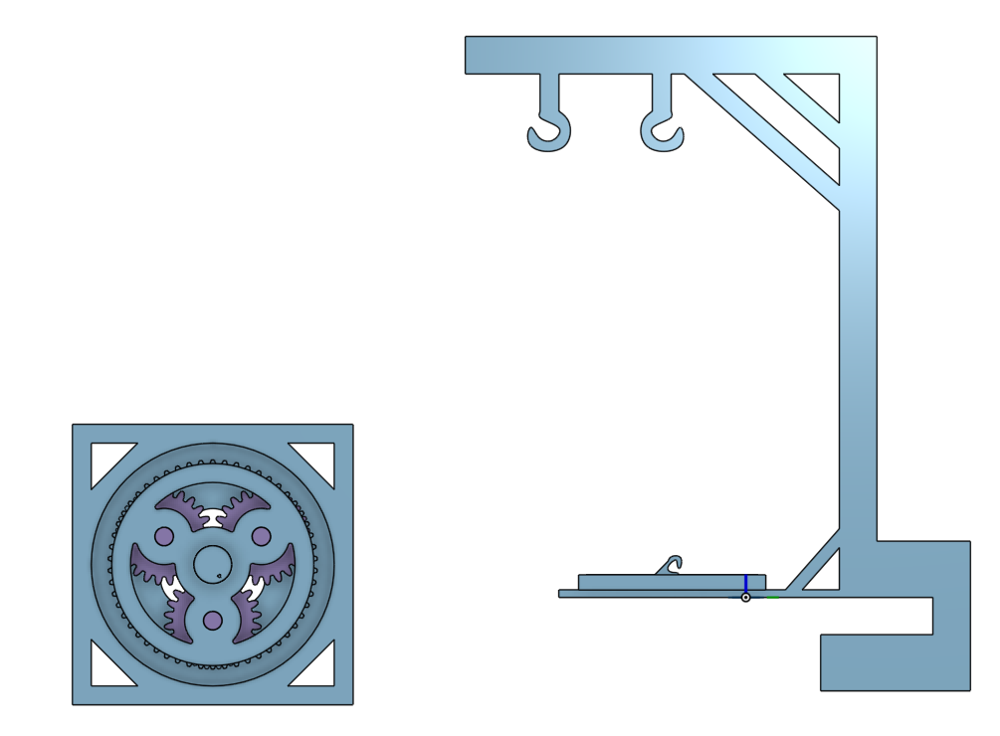
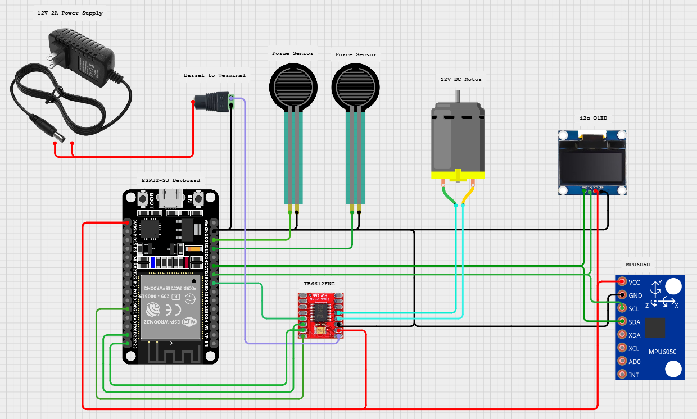

# Crane Advantage!!

a setup made to demonstrate the power of the concept of mechanical advantage and gearboxes to increase the output force of a motor

i made this project to learn the concepts of different parts and how they're used, such as bearings, pulley, and gears, while also learning more about how to CAD

this project features a custom 10:1 planetary gearbox, an accelerometer and force sensors, an esp32s3, and an OLED screen. as the load moves up, the screen will display
the acceleration upwards, the weight of the load, and the input of the motor, and if physics holds true, the input force of the motor will be lower than the weight lifted.

## Concept: 

## CAD: https://cad.onshape.com/documents/25b551bb28101ce6dee20108/w/df9d884192d423a04e43e887/e/0aae6fa08d5e851722291a8d?renderMode=0&uiState=6a1c735059025a2e9c84c776

## Wiring:

## Assembly Instructions:
1. add bearing to back of ring gear, and sun gear to the middle
2. add lever to the motor shaft, and a force sensor below the lever, and attach motor to back of ring gear
3. add planetary gears to ring gear box, and attach output shaft to it
4. put stand on table and add pulleys, and coil cable around it
5. add accelerometer and force sensor to load basket, and attach to cable
6. upload firmware and follow wiring diagram to wire all sensors and display
7. watch load be lifted by motor!

|Item                      |Link                                                 |Price (CAD)|
|--------------------------|-----------------------------------------------------|-----------|
|12V DC Motor              |https://www.aliexpress.com/item/1005009213371004.html|6.23       |
|M15 Pulleys               |https://www.aliexpress.com/item/1005009007535612.html|12.99      |
|6mm ID Bearings           |https://www.aliexpress.com/item/1005009062156404.html|4.59       |
|Super Glue                |https://www.aliexpress.com/item/1005009754258898.html|6.10       |
|Steel Cable               |https://www.aliexpress.com/item/1005009960946600.html|10.58      |
|ESP32-S3                  |https://www.aliexpress.com/item/1005007523988592.html|           |
|i2c OLED                  |https://www.aliexpress.com/item/1005006085392157.html|3.28       |
|MPU6050 Accelerometer     |https://www.aliexpress.com/item/1005008796700745.html|3.18       |
|2x 20g-10kg Force Sensor  |https://www.aliexpress.com/item/1005007061286544.html|10.78      |
|TB6612FNG Motor Driver    |https://www.aliexpress.com/item/1005005756666126.html|2.33       |
|12V 3A Barrel Jack        |https://www.aliexpress.com/item/1005010390772322.html|5.21       |
|Barrel to Terminal Adapter|https://www.aliexpress.com/item/1005009902663897.html|6.73       |
|                          |Total (USD, with tax)                                |51.84      |
